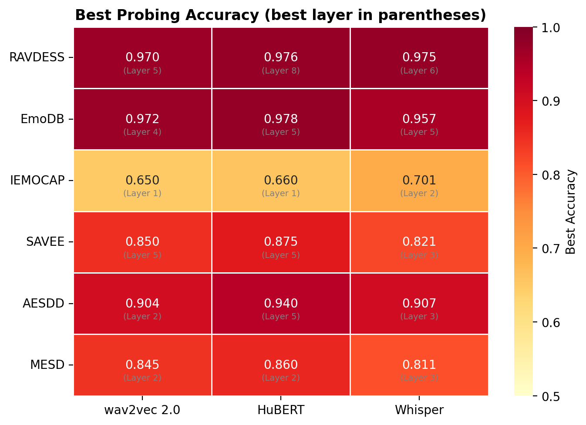
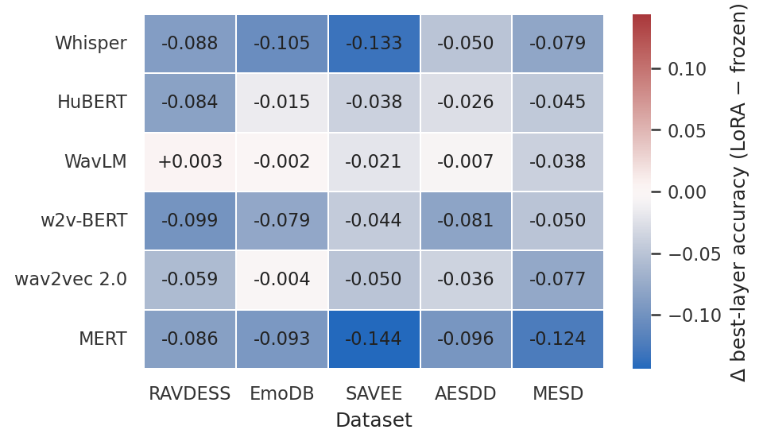
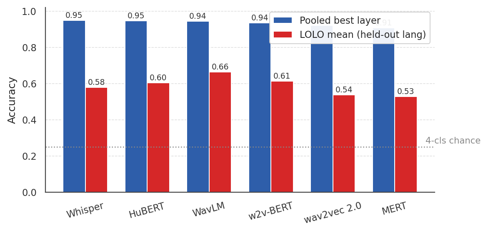
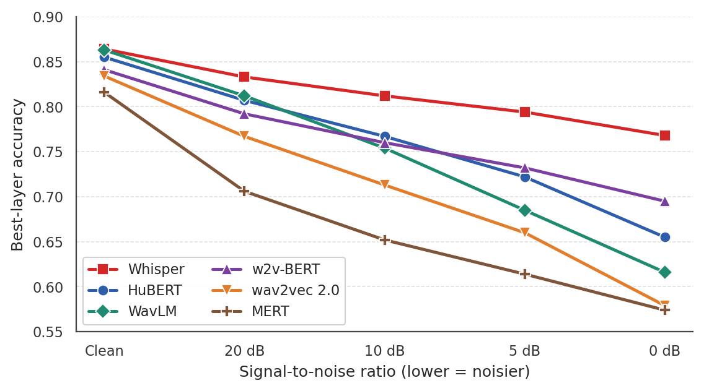
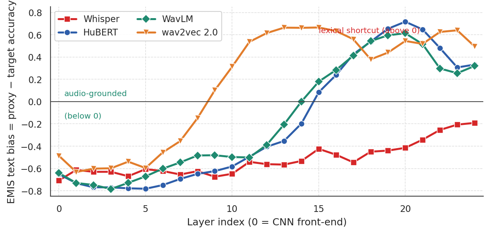
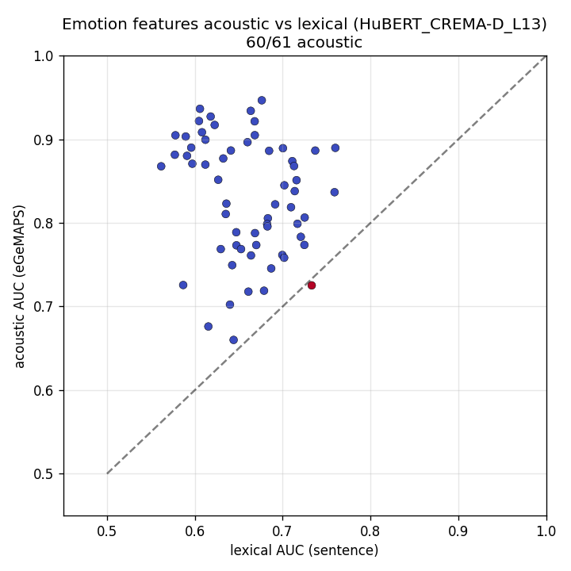

<h1 align="center">Linguistic-Agnostic Speech Emotion Recognition</h1>

<p align="center"><i>Where emotion lives inside a frozen speech encoder, whether that answer survives a change of language, and whether the probe is hearing the voice or reading the words</i></p>

<p align="center">
<a href="https://kelidari.com/linguistic-agnostic-ser/explorer.html"></a>
</p>

<p align="center">


</p>

---

<h2 align="center">Explore It Yourself</h2>

<p align="center">
  <b><a href="https://kelidari.com/linguistic-agnostic-ser/explorer.html">kelidari.com/linguistic-agnostic-ser/explorer</a></b>
</p>

The three experiments that answer the question are plotted live from the result files in this
repository — toggle encoders on and off, and move between layer-wise probing, noise robustness and
dimensional regression. No install, nothing to run.

The fastest way to see the finding: open the **layer-wise** tab and turn everything off except
**wav2vec 2.0** and **Whisper**. wav2vec 2.0 climbs to a peak and then falls off a cliff through its
deepest layers — its contrastive objective pushes those layers toward predicting words, overwriting
the prosody a probe needs. Whisper holds its accuracy to the end. Then switch to **noise** and watch
the same two encoders separate again, in the same direction.

---

<h2 align="center">The Question</h2>

Speech carries emotion two ways at once. There is what a person says, and there is how they say
it. Encoders like wav2vec 2.0, HuBERT, WavLM and Whisper top the emotion benchmarks, but they were
trained to recognise words, so they carry a great deal of linguistic structure. If a probe reading
emotion off those encoders is really reading the words, it will break on sarcasm, on accents, on
low-resource languages, and anywhere delivery and meaning pull apart.

So we asked three things, and built an experiment for each.

| | Question | Answer |
|---|---|---|
| **1. Depth** | At which layer is emotion encoded? | Middle to late, peaking around layer 9 |
| **2. Transfer** | Does that hold across languages and speakers? | Inside a language family, yes. Across one, it collapses |
| **3. Mechanism** | Is the signal acoustic, or lexical? | Acoustic, except where a shortcut is available |

The third question is the one that changed how we read the first two. High probe accuracy is not
evidence that a model hears emotion in the voice, so every headline here is paired with a test
built to falsify it.

### Team

| | Contribution |
|---|---|
| **Nima Kelidari** | Shared pipeline and cluster infrastructure, the six-encoder probing grid, noise robustness, MSP-Podcast, the dimensional track, and the sparse-autoencoder study |
| **Chaitanya Parwatkar** | The original probing pipeline everything else builds on, BERT alignment, the layer mixer, LoRA fine-tuning, CREMA-D |
| **Minoo Ahmadi** | Leave-one-speaker-out validation, adversarial and CCA debiasing, the EMIS text-bias study, IEMOCAP annotator disagreement |
| **Xiangxu (Henry) Lin** | The cross-lingual analysis code behind the SpeechCraft experiment |

USC students, working with Prof. Mohammad Soleymani on this project. Per-person detail is in
[Contributions](#contributions), and `git shortlog -sne` reproduces it from the history.

---

<h2 align="center">Headline Results</h2>

<div align="center">

| Best probe | Where emotion peaks | Cross-language transfer |
|:---:|:---:|:---:|
| **0.9888** | **Layer 9** | **0.28 to 0.32** |
| HuBERT layer 11 on EmoDB, linear probe on frozen features | median across 6 encoders and 7 corpora, falling to 0.713 by layer 24 | English to Mandarin, against a 0.25 chance floor |

</div>

---

<h2 align="center">1. Depth: Emotion Is a Middle-Layer Property</h2>

Six frozen encoders, seven corpora, all 25 hidden states, a linear probe on mean-pooled features
with five-fold stratified cross validation. Around 360 probe fits.

<p align="center">

<br><sub>Accuracy by layer. The ridge sits in the middle of every encoder, not at the top.</sub>
</p>

Mean accuracy across the grid separates the encoders by less than four points: Whisper 0.8303,
WavLM 0.8294, HuBERT 0.8241, MERT 0.7826, w2v-BERT 0.7744, wav2vec2 0.7503. Corpus difficulty
dominates instead, from EmoDB at 0.9414 down to MSP-Podcast at 0.6009. Acted speech peaks in the
middle layers, spontaneous speech peaks earlier.

**Fine-tuning does not help.** LoRA across 30 encoder and corpus combinations loses to the frozen
probe in 29 of them, by 0.062 on average at the best layer and 0.173 in the deep band.

<p align="center">

<br><sub>Red is where fine-tuning lost. Work by Chaitanya Parwatkar.</sub>
</p>

---

<h2 align="center">2. Transfer: The Ceiling Is Language, and Labels</h2>

**Speakers.** Random cross validation lets one speaker land in both train and test. Held out
properly, the number moves a long way on some corpora: MESD falls 0.301 and RAVDESS 0.180, while
EmoDB and IEMOCAP barely move at 0.030. A score reported without speaker-disjoint folds is not
comparable to one reported with them.

**Languages.** Pool English, German, Greek and Spanish and every encoder reaches 0.91 to 0.95.
Hold one language out and it depends entirely which: German held out is fine at 0.952, English
drops to 0.691, Spanish collapses to 0.375. Add Mandarin and the pool falls to around 0.50. Train
on English and test on Mandarin and it lands at 0.28 to 0.32, against a 0.25 chance floor.

<p align="center">

<br><sub>Pooled training hides the problem. Leaving a language out exposes it.</sub>
</p>

Pooling is what makes cross-lingual numbers look good, and also what makes them hard to interpret.
The pool is 64% English and 44% one emotion class, so the majority baseline is 44% and belongs
beside every pooled figure. We wrote that up against our own claim in
[`docs/EXP20_pool_stats.md`](docs/EXP20_pool_stats.md).

**Labels.** On IEMOCAP the probe stalls around 0.65 to 0.70 whichever encoder is used. Restricting
to clips where the human annotators agreed lifts accuracy by 0.145 to 0.191. That ceiling is label
noise rather than model capacity.

**Noise.** Under ESC-50 noise at 0 dB, Whisper degrades least at 10.89% relative accuracy loss and
wav2vec2 most at 29.63%. The same ordering holds in the dimensional track.

<p align="center">

<br><sub>Whisper's supervised multilingual pretraining buys robustness the SSL encoders do not have.</sub>
</p>

---

<h2 align="center">3. Mechanism: Acoustic, Until a Shortcut Appears</h2>

Probe accuracy tells you emotion is decodable. It does not tell you from what. Two experiments
answer that directly.

**The text-bias test.** EMIS pairs audio with transcripts whose emotion deliberately disagrees with
the delivery. A model reading the words follows the text, a model hearing the voice ignores it. The
SSL encoders follow the text, strongly: wav2vec2 +0.868, HuBERT +0.794, WavLM +0.731. Whisper does
not, at -0.108, and neither do MERT or w2v-BERT.

<p align="center">

<br><sub>Every encoder is audio-grounded through layer 8. The shortcut is a deep-layer behaviour and only in the ASR-pretrained SSL encoders. Work by Minoo Ahmadi.</sub>
</p>

**Sparse autoencoders.** A linear probe reads whatever is linearly present. To ask which features
the encoder actually carries, we trained TopK sparse autoencoders on per-frame activations, 8192
features with 32 active at a time, reconstructing 93% of the variance with 4 dead features.

The naive reading finds 394 significant, monosemantic emotion features. Most are not emotion
features at all. CREMA-D is factorial, 91 actors each speaking 12 fixed sentences in 6 emotions,
so the design that makes emotion decodable also lets us ask whether a feature says more about the
emotion than about the sentence or the speaker. Requiring that leaves **61**, removing 84% of the
original set.

<p align="center">

<br><sub>60 of the 61 surviving features track acoustic descriptors rather than the sentence.</sub>
</p>

Three results follow, and the first is the one worth carrying elsewhere.

- **Decodability and disentanglement peak at different depths.** Probe accuracy peaks at layer 10,
  the count of clean emotion features at layer 7. Deep layers stay decodable and stop being
  interpretable, which is a caution about reading probe curves as mechanism.
- **The signal is acoustic.** 60 of 61 features align with eGeMAPS descriptors rather than the
  sentence, 0.830 against 0.660. Reconstructing from only those 61 decodes emotion at 0.552,
  against 0.423 for a random feature set of the same size.
- **The features are speaker-invariant.** Held out by speaker they lose essentially nothing, which
  says the leave-one-speaker-out collapse elsewhere comes from exactly the speaker-entangled
  features this control removes.

Method and full findings: [`docs/sae/FINDINGS.md`](docs/sae/FINDINGS.md).

---

<h2 align="center">What Held Up and What Did Not</h2>

<div align="center">

| Claim | Verdict | Evidence |
|---|:---:|---|
| Emotion peaks in middle layers | ✅ | Layer 9 median across 6 encoders and 7 corpora, holds under a fixed lexicon |
| Encoder choice is what matters | ❌ | Under four points separates six encoders. Corpus choice spans 0.34 |
| Fine-tuning beats frozen probing | ❌ | Frozen wins 29 of 30 LoRA runs |
| Emotion encoding is language-agnostic | ⚠️ | Within a language family. English to Mandarin is 0.28 to 0.32 against 0.25 chance |
| Pooled multilingual accuracy | ❌ | 64% English, 44% majority class, so the pooled number says little on its own |
| High IEMOCAP accuracy is reachable | ❌ | The 0.65 to 0.70 ceiling is annotator disagreement |
| Probes measure acoustic emotion | ⚠️ | For Whisper and MERT yes. SSL encoders take the lexical shortcut when offered one |
| Debiasing removes the shortcut | ❌ | Adversarial and CCA both cost more accuracy than the bias they remove |
| SAE features are genuinely emotional | ⚠️ | Only after a confound control. 394 becomes 61 |

</div>

---

<h2 align="center">Project Structure</h2>

```
src/
  data_ingestion/loader.py        corpus loaders, one record schema
  preprocessing/                  resampling, mean pooling, ESC-50 noise mixing
  models/feature_extractors.py    frozen encoder, all 25 hidden states
  pipelines/train.py              layer-wise probe, stratified and grouped CV
  sae/                            sparse autoencoder study, steps 1 to 8b
scripts/run_pipeline.py           one entry point, config driven
slurm/                            array jobs, one per experiment matrix
results/EXP4..EXP10, EXP20        per-layer CSVs, plots, written summaries
results/{LOSO,TASK6,TASK7}        speaker holdout, debiasing, EMIS
docs/sae/FINDINGS.md              the sparse autoencoder write-up
docs/index.html                   project page
```

The probe pipeline is one path end to end. `run_pipeline.py` reads `config/config.yaml`, loads a
corpus, extracts every hidden state from a frozen encoder, mean-pools, fits one probe per layer,
and writes a CSV and plots under `results/EXP{N}/`. Each SLURM array script pins one experiment
matrix onto that path, so an experiment is a set of arguments rather than a fork of the code. The
SAE study reuses the same extractor and adds its own steps under `src/sae/steps/`.

<details>
<summary><b>Install and run</b></summary>

```bash
conda env create -f environment.yml && conda activate ser_env
# or: pip install -r requirements.txt

python scripts/run_pipeline.py --exp_id 4 --task classification
python scripts/run_pipeline.py --exp_id 5 --task classification --snr_db 0
python -m src.sae.steps step1 --dataset CREMA-D --layer 13
sbatch slurm/submit_pipeline.sbatch          # 6 encoders x 6 corpora
```

Experiment tracking goes to Weights and Biases under entity `AGSER`. Tests: `pytest tests/`.
</details>

---

<h2 align="center">Honest Limits</h2>

Most corpora here are acted, which overstates how separable emotion is. MSP-Podcast and IEMOCAP are
the realistic ones and both sit near 0.60 to 0.70. The cross-lingual pool is roughly 4,000 clips
rather than the 20,000 an earlier draft of ours claimed, and it is unbalanced by language and by
class. The SAE study runs on CREMA-D because its factorial design is what makes the confound
control possible, so the 61-feature result is one corpus deep. Ablating those features does not
reduce accuracy, so the evidence for them is sufficiency rather than necessity, and we report it
that way.

---

<h2 align="center">Contributions</h2>

**Nima Kelidari.** The shared pipeline and cluster infrastructure the other tracks run on: loaders,
the frozen extractor, the layer-wise prober, the SLURM array scripts and the FastAPI dashboard.
Experiments 4 through 10, meaning the six-encoder probing grid, ESC-50 noise robustness,
MSP-Podcast at four and eight classes, and the dimensional valence, arousal and dominance track.
Ran the SpeechCraft cross-lingual sweep. The sparse-autoencoder study is his in full, including the
confound control that cuts 394 features to 61, the depth analysis, the acoustic versus lexical test
and the EMIS layer sweep.

**Chaitanya Parwatkar.** The original probing pipeline, which is the baseline every later
experiment is measured against. BERT alignment between speech and text representations by CKA,
Procrustes and centroid distance, including the transcript variant. The learned layer mixer, which
showed Whisper concentrating 64% to 95% of its attention on the final layer while the SSL encoders
spread theirs across the middle. LoRA fine-tuning over 30 encoder and corpus pairs. CREMA-D.

**Minoo Ahmadi.** Leave-one-speaker-out validation across 42 encoder and corpus pairs, which is
what exposed how much published accuracy is speaker leakage. Adversarial gradient reversal and
BERT-CCA debiasing, reported as the negative result it turned out to be. The EMIS congruent and
incongruent study behind the text-bias measurement, and the IEMOCAP annotator disagreement analysis
that explained its accuracy ceiling. The midterm eighteen-experiment sweep.

**Xiangxu (Henry) Lin.** The cross-lingual analysis and data code behind the SpeechCraft
experiment, and the data description in the midterm report.

---

<p align="center">
<sub><b>Nima Kelidari</b> &nbsp;·&nbsp; <b>Chaitanya Parwatkar</b> &nbsp;·&nbsp; <b>Minoo Ahmadi</b> &nbsp;·&nbsp; <b>Xiangxu Lin</b></sub><br>
<sub>University of Southern California</sub><br>
<sub>Built with PyTorch, Hugging Face Transformers, openSMILE and scikit-learn</sub>
</p>
