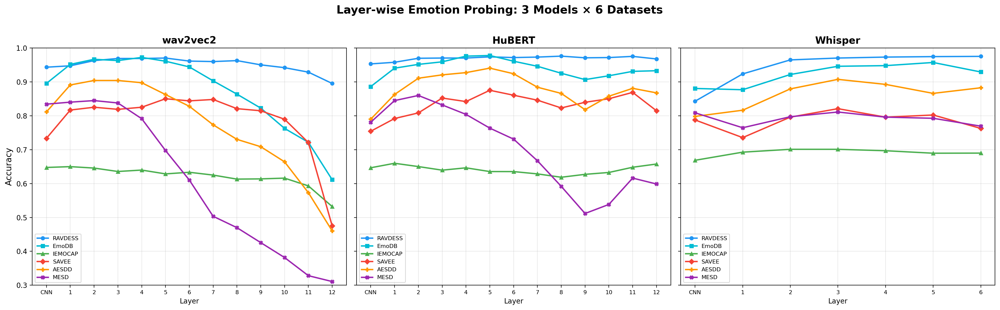

# Linguistic-Agnostic SER: A Probing Approach to Acoustic Emotion Encoding


## Project Overview

This repository contains the core implementation for probing Speech Emotion Recognition (SER) transformers to detect how paralinguistic, acoustic knowledge is encoded across their layers. Inspired by the reference paper *Probing Speech Emotion Recognition Transformers for Linguistic Knowledge*, this framework maps the layer-stratified acoustic hierarchy of modern self-supervised audio models.

Modern SER systems (e.g., wav2vec 2.0, HuBERT) rely on massive transformers that often leverage implicit linguistic cues. This project explicitly addresses three core analytical challenges:

1. **Acoustic Baseline Extraction:** Pulling precise, handcrafted paralinguistic metrics (like pitch, jitter, and loudness) to serve as objective ground truths.
2. **Hidden State Isolation:** Intercepting and freezing intermediate representations across all layers of pre-trained Hugging Face audio transformers.
3. **Layer-Wise Probing:** Deploying lightweight statistical probes to predict acoustic metrics from hidden states, evaluating exactly *where* and *how* acoustic signals are retained or discarded throughout the network.

## Features & Core Methodology

### 1. Data Processing & Acoustic Extraction (`data_loader.py`)

* **Goal:** Standardize incoming audio tensors and compute reference acoustic targets.
* **Algorithm/Process:**
* **Standardization:** Handles audio dataset loading, resampling, scaling, and precise cropping/padding of raw `.wav` sequences.
* **eGeMAPS Features:** Leverages the OpenSMILE `FeatureExtractor` to pull classic baseline targets (e.g., `F0semitoneFrom27.5Hz_sma3nz_amean`) perfectly aligned with the audio tensors.


### 2. Transformer Representation Extraction (`model_extractor.py`)

* **Goal:** Harvest the intermediate neural representations from frozen self-supervised models.
* **Algorithm/Process:**
* **Model Wrapping:** Acts as a utility wrapper for Hugging Face `transformers`.
* **State Isolation:** Passes audio through models like `facebook/wav2vec2-base` or `facebook/hubert-base-ls960`, isolates the hidden states at every layer (0 to N), and detaches them from the computation graph to ensure the backbone remains strictly frozen.


### 3. Evaluation & Probing Logic (`probing.py`)

* **Goal:** Quantify the acoustic information present within each discrete transformer layer.
* **Algorithm/Process:**
* **Statistical Probing:** Fits lightweight models (e.g., Ridge Regression for continuous features, Logistic Regression for categorical) against the extracted hidden states.
* **Cross-Validation:** Implements rigorous K-Fold Cross Validation to ensure generalized metric prediction.
* **Metric Tracking:** Computes the Root Mean Square Error (RMSE) and tracks the relative information increase/decay compared to the raw embedding layer.


## Installation

1. **Clone the repository:**
```bash
git clone https://github.com/nikelroid/linguistic-agnostic-ser.git
cd linguistic-agnostic-ser

```


2. **Install Dependencies:**
The project relies on PyTorch for tensor operations and Hugging Face for model access.
```bash
pip install -r requirements.txt

```


3. **Data Preparation:**
Create a directory and place your `.wav` files inside. Supported common datasets include **RAVDESS**, **SAVEE**, and **IEMOCAP**.

## Code Description & Usage

### The Orchestrator (`main.py`)

* **Purpose:** The main executable that connects data loading, feature extraction, hidden state extraction, and layer-wise probing into a single pipeline.
* **Process:**
1. Scans the provided `--data_dir` for audio samples.
2. Dispatches files to `data_loader.py` for target generation via OpenSMILE.
3. Pushes audio through the specified `--model_name` via `model_extractor.py`.
4. Evaluates each layer using the K-Fold logic in `probing.py`.
5. Calculates analytical metrics using `calculate_information_increase()` from `utils.py`.


* **Output:** Generates a `.csv` summarizing the hidden layer index, mean RMSE across K-folds, and the Information Increase %.
* **Run:**
```bash
python main.py \
  --data_dir data/my_audio_files \
  --model_name facebook/wav2vec2-base \
  --target_feature F0semitoneFrom27.5Hz_sma3nz_amean \
  --batch_size 4

```


### Analytical Helpers (`utils.py`)

* **Purpose:** Handles downstream data manipulation and final metric computations.
* **Key Functions:** Includes `calculate_information_increase()`, which calculates the relative drop in RMSE from the 0th layer (raw embeddings) to track performance trajectories across the transformer depth.

## Expected Results & Visualization

The output `.csv` files can be visualized to track acoustic information retention. By plotting the Information Increase % across layer depth, you can interpret linguistic vs. acoustic layer drops, confirming baseline academic literature on how models like HuBERT or wav2vec 2.0 process speech step-by-step.

## Comprehensive Experiment Results

We have conducted extensive probing layer-by-layer across **3 Models** (`wav2vec2`, `HuBERT`, `Whisper`) and **6 Datasets** (`RAVDESS`, `EmoDB`, `IEMOCAP`, `SAVEE`, `AESDD`, `MESD`). The summary of the best performing layers out of all 18 combinations is provided below:

| Model | Dataset | Best Layer | Best Accuracy | Best F1 |
|---|---|---|---|---|
| wav2vec2 | RAVDESS | Layer 5 | 0.9701 | 0.9701 |
| wav2vec2 | EmoDB | Layer 4 | 0.9720 | 0.9719 |
| wav2vec2 | IEMOCAP | Layer 1 | 0.6498 | 0.6498 |
| wav2vec2 | SAVEE | Layer 5 | 0.8500 | 0.8473 |
| wav2vec2 | AESDD | Layer 2 | 0.9039 | 0.9035 |
| wav2vec2 | MESD | Layer 2 | 0.8446 | 0.8443 |
| HuBERT | RAVDESS | Layer 8 | 0.9757 | 0.9757 |
| HuBERT | EmoDB | Layer 5 | 0.9776 | 0.9774 |
| HuBERT | IEMOCAP | Layer 1 | 0.6597 | 0.6594 |
| HuBERT | SAVEE | Layer 5 | 0.8750 | 0.8722 |
| HuBERT | AESDD | Layer 5 | 0.9403 | 0.9399 |
| HuBERT | MESD | Layer 2 | 0.8597 | 0.8588 |
| Whisper | RAVDESS | Layer 6 | 0.9750 | 0.9751 |
| Whisper | EmoDB | Layer 5 | 0.9570 | 0.9566 |
| Whisper | IEMOCAP | Layer 2 | 0.7009 | 0.7009 |
| Whisper | SAVEE | Layer 3 | 0.8208 | 0.8183 |
| Whisper | AESDD | Layer 3 | 0.9072 | 0.9068 |
| Whisper | MESD | Layer 3 | 0.8109 | 0.8108 |

### Visualizations

You can find comprehensive visualizations inside the `SER_all_experiments` directory:
- ****: Heatmap showing performance distribution across the transformer layers.
- ****: 3-panel plotting of detailed layer-wise probing results across all combinations.

## Contributing

1. Fork the project.
2. Create your feature branch (`git checkout -b feature/NewProbe`).
3. Commit your changes (`git commit -m 'Add new SVM probing classifier'`).
4. Push to the branch (`git push origin feature/NewProbe`).
5. Open a Pull Request.

## License

This project is open-source. Please attribute the original authors when using or modifying this codebase for academic or personal research.
