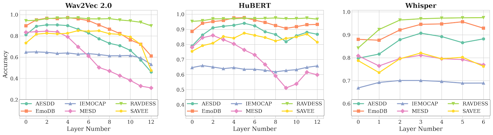
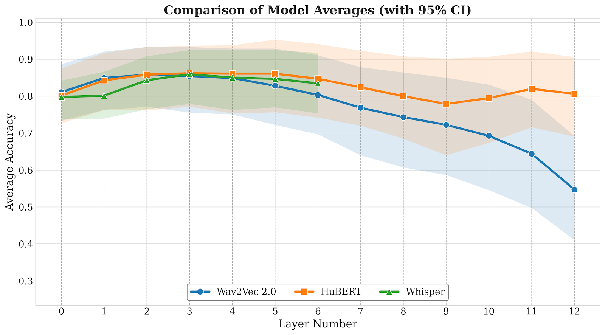
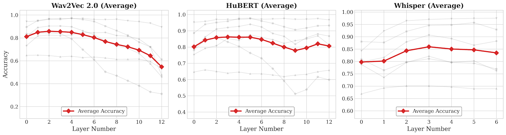
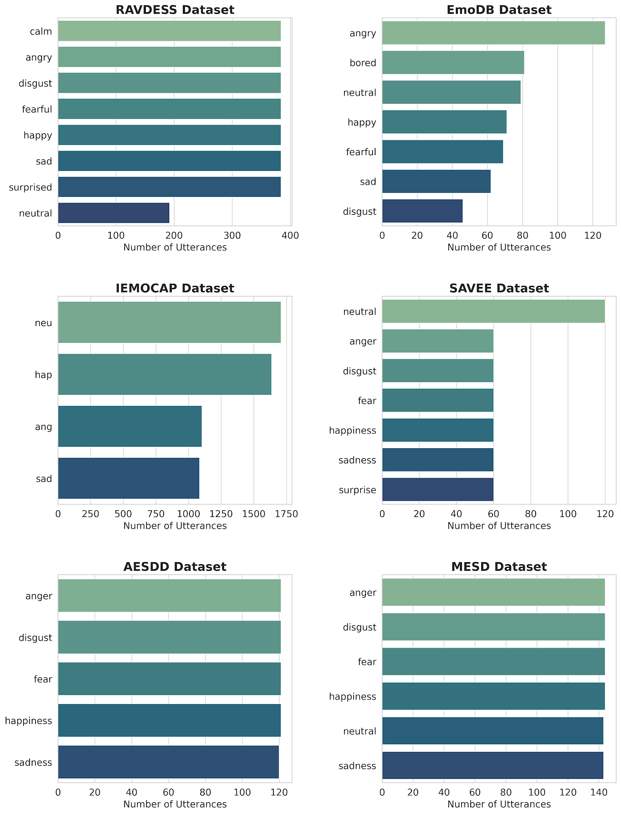
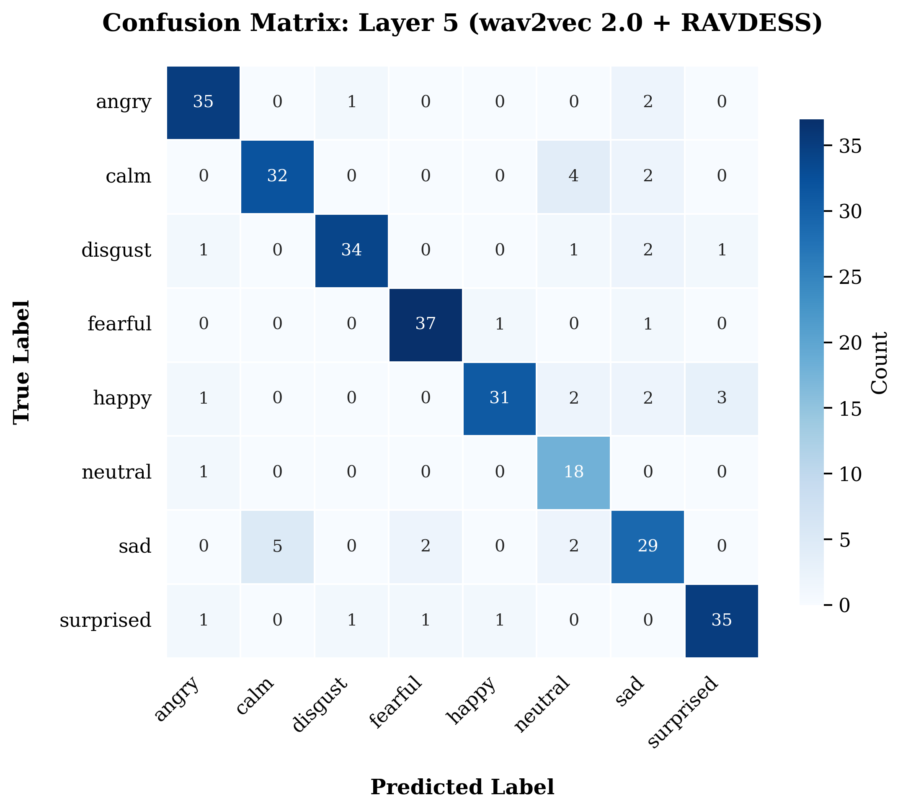

# Linguistic-Agnostic Speech Emotion Recognition: A Probing Approach to Acoustic Emotion Encoding


## Project Overview

This repository contains an MLOps-ready framework for probing Speech Emotion Recognition (SER) transformers to detect how paralinguistic, acoustic knowledge is encoded across their layers. 

Modern SER systems (e.g., wav2vec 2.0, HuBERT, Whisper) rely on massive transformers that implicitly leverage linguistic cues. This project explicitly maps the acoustic hierarchy by extracting hidden states across all layers and using linear probes to evaluate layer-wise emotion retention. Our findings show that middle layers (typically layers 2–5) usually yield optimal performance for acted speech, whereas earlier layers (layers 1–2) are most effective for spontaneous conversation. 

### Team Members
- **Nima Kelidari** (kelidari@usc.edu)
- **Minoo Ahmadi** (minooahm@usc.edu)
- **Chaitanya Parwatkar** (parwatka@usc.edu)
- **Xiangxu Lin** (xiangxul@usc.edu)

---

## Features & Project Structure

The codebase has been refactored into a clean, modular MLOps architecture. 

```
linguistic-agnostic-ser/
├── config/                     # Universal YAML configuration definitions
├── docs/                       # Theoretical and mechanical documentation
├── notebooks/                  # Consolidated R&D experimental notebooks
├── src/
│   ├── data_ingestion/         # Loaders for 6 datasets: RAVDESS, EmoDB, IEMOCAP, SAVEE, AESDD, MESD
│   ├── preprocessing/          # Audio resampling, cropping, and dataset logic
│   ├── models/                 # Transformer wrapper and hidden state extractor 
│   ├── pipelines/              # Training logic (cross-val logreg) and plot generation
│   └── utils/                  # Helper math functions and config parsers
├── scripts/                    # Entrypoints for running headless pipelines
├── server/                     # FastAPI backend and vanilla Javascript Premium UI
└── results/                    # Extracted embeddings, raw CSV outputs, and visual plots
```

### 1. Data Processing Pipeline (`src/data_ingestion/`, `src/preprocessing/`)
Dynamically parses multiple audio corpora using optimal metadata extraction and standardizes them to 16kHz for uniform Transformer ingest.

### 2. Transformer Representation Extractor (`src/models/feature_extractors.py`)
Intercepts and freezes representations across all layers of models like `facebook/wav2vec2-base` or `facebook/hubert-base-ls960`. Detaches memory dynamically to maintain low compute overhead.

### 3. Layer-Wise Statistical Probing (`src/pipelines/train.py`)
Fits lightweight logistic models across hidden states using rigorous 5-Fold Stratified Cross-Validation to guarantee generalized inference over different validation domains.

---

## Installation

1. **Clone the repository:**
```bash
git clone https://github.com/nikelroid/linguistic-agnostic-ser.git
cd linguistic-agnostic-ser
```

2. **Install Dependencies:**
The project relies on PyTorch, Transformers, Audio packages, and FastAPI.
```bash
pip install -r requirements.txt
pip install fastapi uvicorn python-multipart pyyaml  # Core framework requirements
```

---

## Usage

### Method 1: Web Interface (FastAPI UI)

To explore predictions visually via a premium, dark-mode browser dashboard:
1. Start the server:
```bash
uvicorn server.main:app --reload
```
2. Navigate to `http://localhost:8000/` locally.
3. Drag & drop `.wav` files for analysis, or explore dynamically pre-loaded results. Follow the Live Terminal pipeline stream directly in-browser.

### Method 2: Command Line Pipeline Execution

To extract features and cross-validate layers on raw datasets from the CLI:

```bash
python -m scripts.run_pipeline \
  --task classification \
  --data_dir /path/to/RAVDESS_folder \
  --dataset_name RAVDESS \
  --model_name facebook/wav2vec2-base \
  --batch_size 4
```

### Method 3: Notebook Playgrounds
For iterative R&D, open `notebooks/01_exploratory_probing_analysis.ipynb` to view theoretical methods, or `notebooks/02_mass_experiments.ipynb` to view our fully aggregated 18 experiments crossing 3 variants (w2v2, HuBERT, Whisper) against 6 domains.

---

## Performance Statistics 

Our comprehensive evaluation on over **18 combinations** highlighted the behavior of layered embeddings. Below are the peak evaluation metrics acquired across the differing pre-training paradigms:

| Dataset (Language, Style) | Model | Best Layer | Accuracy | Weighted F1 |
|---|---|---|---|---|
| **RAVDESS** (English, Acted) | wav2vec 2.0 | Layer 5 | 0.9701 | 0.9701 |
| **RAVDESS** (English, Acted) | HuBERT | Layer 8 | 0.9757 | 0.9757 |
| **RAVDESS** (English, Acted) | Whisper | Layer 6 | 0.9750 | 0.9751 |
| **EmoDB** (German, Acted) | wav2vec 2.0 | Layer 4 | 0.9720 | 0.9719 |
| **EmoDB** (German, Acted) | HuBERT | Layer 5 | 0.9776 | 0.9774 |
| **EmoDB** (German, Acted) | Whisper | Layer 5 | 0.9570 | 0.9566 |
| **IEMOCAP** (English, Spontaneous) | wav2vec 2.0 | Layer 1 | 0.6498 | 0.6498 |
| **IEMOCAP** (English, Spontaneous) | HuBERT | Layer 1 | 0.6597 | 0.6594 |
| **IEMOCAP** (English, Spontaneous) | Whisper | Layer 2 | 0.7009 | 0.7009 |
| **SAVEE** (British English, Acted) | wav2vec 2.0 | Layer 5 | 0.8500 | 0.8473 |
| **SAVEE** (British English, Acted) | HuBERT | Layer 5 | 0.8750 | 0.8722 |
| **SAVEE** (British English, Acted) | Whisper | Layer 3 | 0.8208 | 0.8183 |
| **AESDD** (Greek, Acted) | wav2vec 2.0 | Layer 2 | 0.9039 | 0.9035 |
| **AESDD** (Greek, Acted) | HuBERT | Layer 5 | 0.9403 | 0.9399 |
| **AESDD** (Greek, Acted) | Whisper | Layer 3 | 0.9072 | 0.9068 |
| **MESD** (Spanish, Acted) | wav2vec 2.0 | Layer 2 | 0.8446 | 0.8443 |
| **MESD** (Spanish, Acted) | HuBERT | Layer 2 | 0.8597 | 0.8588 |
| **MESD** (Spanish, Acted) | Whisper | Layer 3 | 0.8109 | 0.8108 |

---

## Graphical Analysis & Key Findings

We evaluated topological accuracy trajectories rigorously to confirm our architectural findings.

### 1. Architectural Divergences

<div align="center">
  
  <br/>
  <em>Layer-wise probing accuracy broken down by architecture. Wav2vec 2.0 constantly collapses in deeper layers as it enforces linguistic understanding, whereas HuBERT retains emotion into the final layer block. Whisper maintains high baseline accuracy directly out of the box against its 7 internal representations.</em>
</div>

<br/>

<div align="center">
  
  <br/>
  <em>Comparison of average probing accuracy across layers for wav2vec 2.0, HuBERT, and Whisper, computed as the mean accuracy over all six datasets at each corresponding layer.</em>
</div>

**Key Observations:**
- **Middle layers excel for acted speech.** Across datasets like RAVDESS and EmoDB, accuracy consistently peaks between Layers 2 and 5. Early layers merely capture raw frequency bounds, while middle layers actively entwine representations of prosody (pitch and rhythm).
- **Spontaneous conversation peaks earlier.** On raw, conversational datasets like IEMOCAP, the models peak immediately at Layer 1 or 2 as real-world emotion relies heavily on abrupt acoustic fluctuations, not highly structured theatrical contours.
- **HuBERT retains emotion better than wav2vec 2.0.** HuBERT’s internal offline clustering preserves emotional signals deeply; wav2vec 2.0’s contrastive predictive learning structurally overwrites prosodic dynamics.

### 2. General Representation Maps

<div align="center">
  
  <br/>
  <em>Layer-wise probing accuracy for all 18 experiments simultaneously, grouped by model. Each color represents a distinct dataset.</em>
</div>

**Key Observation:**
- **Emotional encoding is language-agnostic.** Despite architectures pre-training exclusively on English logic maps natively, the feature extractions reliably behaved predictably over entirely unseen dialects like Spanish (MESD), German (EmoDB), and Greek (AESDD).

### 3. Emotion-Specific Confusion Mapping

<div align="center">
  
  <br/>
  <em>Class distribution of emotional utterances across all evaluated testing datasets mapping the degree of balance.</em>
</div>

<br/>

<div align="center">
  
  <br/>
  <em>Confusion matrix from Layer 5, wav2vec 2.0 on RAVDESS testing predictions vs truth distributions.</em>
</div>

**Key Observation:**
Fear (high-pitch, shaky amplitude) is consistently the easiest categorical target for the layer probes to decipher successfully since its physical signature is profoundly distinct. On the other hand, *Sadness* heavily confuses the acoustic classifiers—often misidentified as *Calm* due to the structurally slow, low-energy vocal bandwidth overlapping heavily between both states, reinforcing that the probe explicitly maps accurate physical structures.
